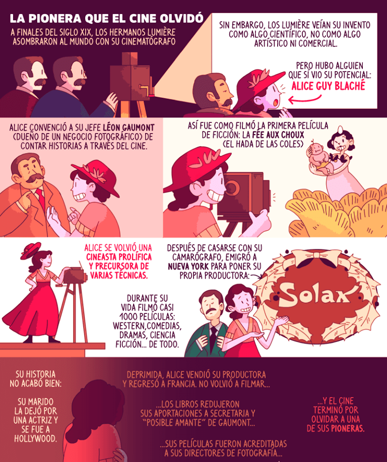
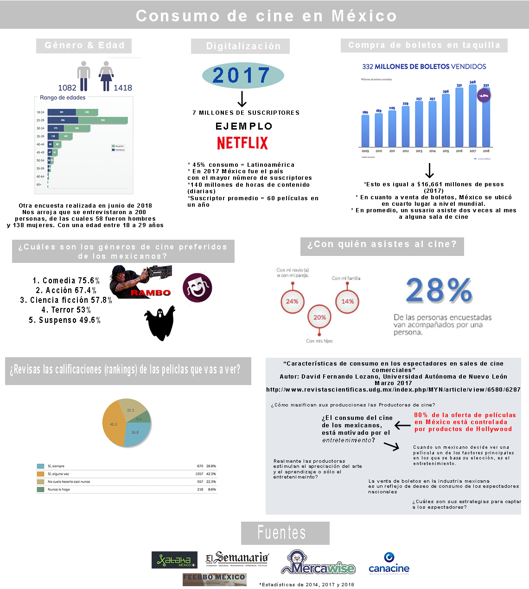
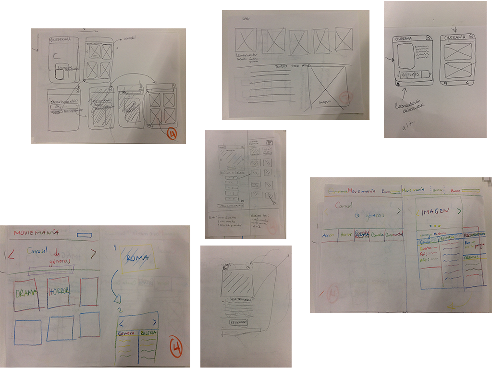
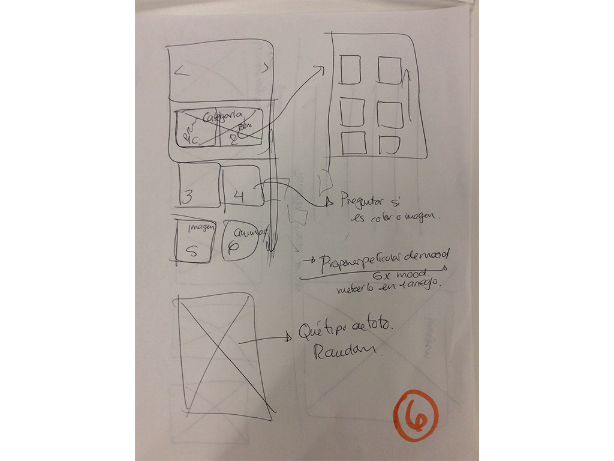
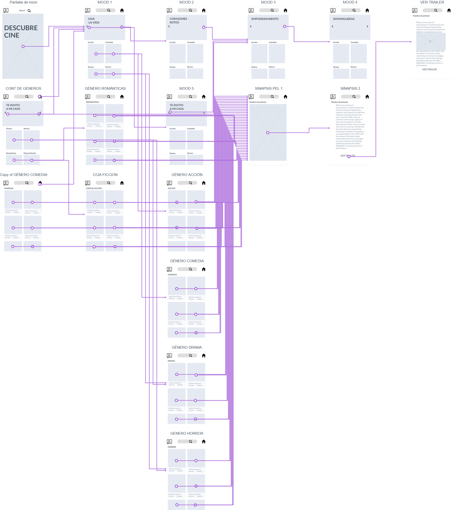
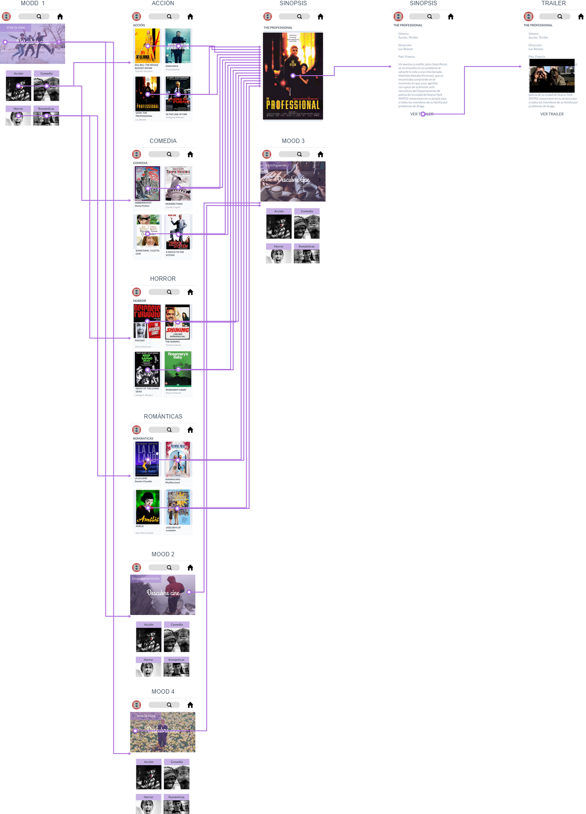
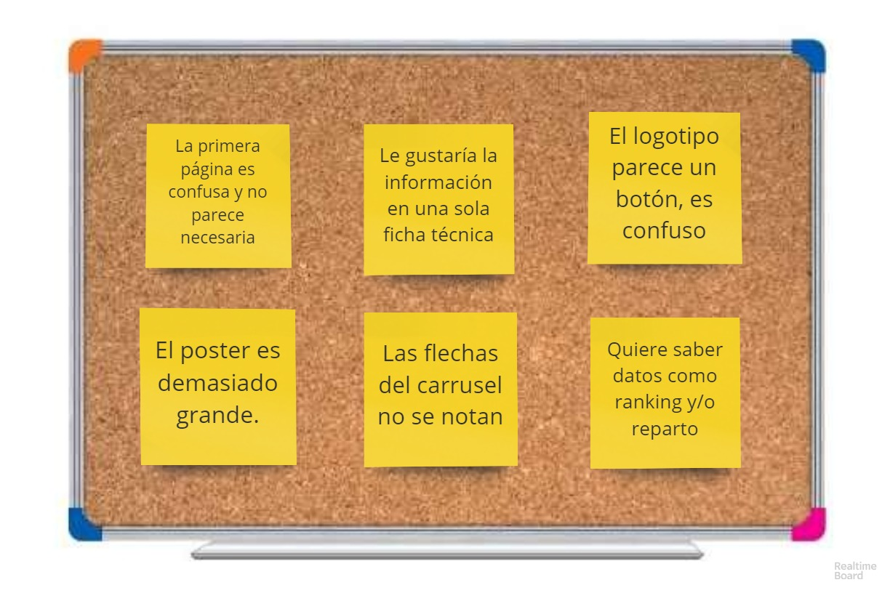

## Salón Rojo.

<!-- ## Índice

- [Preámbulo](#preámbulo)
- [Prototipo persona](#prototipo-persona)
- [Investigación consumo del cine en México](#investigación-consumo-del-cine-en-México)
- [Iteración prototipo persona](#iteración-prototipo-persona)
- [Definición del producto](#definición-del-producto)
- [Historias de usuario](#historias-de-usuario)
- [Investigación de productos existentes en el mercado (referencias)](#prototipo-de-baja-fidelidad)
- [Prototipo de baja fidelidad](#prototipo-de-baja-fidelidad) -->

<!-- --- -->

## Preámbulo

Que levante la mano quién no hay ido nunca al cine para ver una película. Y es que es normal, ya que el denominado séptimo arte tiene ya más de 120 años de historia. Aunque en la actualidad los efectos especiales hacen que veamos imágenes espectaculares en la pantalla del cinema, no siempre ha sido así. En "Descubre Cine" nos gustaría explicarte la historia del cine, su origen, quién inventó el cine y su evolución con el paso del tiempo. ¿Empezamos?

Las posibilidades reales que podía tener el cine fueron fueron adivinadas por el belga Joseph-Antoine Plateau, que en el 1828 mediante un artilugio de su invención mostraba imágenes en movimiento. Es el antecedente más antiguo y más parecido al cine actual.

La invención de la fotografía condujo rápidamente al desarrollo del cine. Ya en 1874 el astrónomo francés Jules Janssen obtenía éxitos con su “revólver fotográfico”, antepasado de la cámara fotográfica actual.

## Primeros pasos del cine
Pero como en tantas otras cosas, fueron los trabajos de Thomas Alva Edison (el inventor de la bombilla) en 1889, los que llevaron al invento de lo que él llamó kinetógrafo: primera cámara sonora. Invento importante en el que Edison puso en relación el eje del obturador de la cámara con un fonógrafo, permitiendo grabar sonido e imagen a la vez.

## Quién inventó el cine
Y aunque la fotografía fue determinante en el desarrollo y progreso del cinematógrafo, la fecha de nacimiento de este arte no es anterior al 28 de diciembre de 1895, en el Salón Indien del Gran Café del Boulevard de los Capuchinos de París.

- ¿Quién inventó el cine? Fueron los hermanos Lumière.
- ¿Cuándo se inventó el cine? el 28 de diciembre de 1895.
- ¿Dónde se inventó el cine? fue en París, la capital de Francia.

## Investigación consumo del cine en México

## Prototipo persona

<!-- ## Iteración prototipo persona

Una vez que realizamos investagación, identificamos algunas puntos que eran necesarios cambiar en el prototipado de persona: -->

## Definición del producto

¿Te ha pasado que no sabes que ver, y buscas durante muchos minutos? ¡Te entendemos! Sabemos cómo te sientes y lo frustrante que puede llegar a ser.
**Salón Rojo** es una interfaz que está dirigida tanto a mujeres como hombres de entre 25-30 años que desean obtener recomendaciones de películas mediante género o accediendo a nuestras dinámicas y divertidas **play-movies**. **Play-movies** hace referencia a recomendaciones de películas mediante estados de ánimo.
Resolviendo la tediosa tarea de buscar una película por mucho tiempo sin encontrar una que te atrape, en **Sillón Rojo** nos dimos a la tarea de recomendarte una cinta según tu estado de animo.

En **Salón Rojo** estamos comprometidas en mostrar las diferentes opciones de películas para tu entretenimiento y a la vez nos interesa que conozcas más opciones de las que te ofrece el cine comercial.

**Salón Rojo** se muestra como una propuesta fresca, pero a la vez  empática e interesada en las motivaciones de l@s usuari@s para consumir cine. Además en **Salón Rojo** queremos ayudar a que nuestr@s usuari@s no pierdan sus tiempo en búsquedas infinitas.

## Historia de la marca: Buscando el nombre ideal
Nos inspiramos en el emblemático **Salón Rojo** recinto catalogado como el primer cine de la Ciudad de México y el primero con escaleras eléctricas, que hizo su incursión como sala cinematografica el 6 de Agosto de 1896.

Fuente: "El Universal"

## Historias de usuario

1. Yo como usuario quiero una plataforma en dónde pueda encontrar películas mediante genero y mi estado de ánimo.
2. Yo como usuario quiero que la plataforma sea mobile first con opción responsive
3. Yo como usuario quiero poder filtrar las películas mediante género
4. Yo como usuario quiero recomendación de películas para mi estado de ánimo
5. Yo como usuario quiero que se desplieguen las películas que filtre.
6. Yo como usuario quiero que las películas se muestren mediante portada y nombre
7. Yo como usuario quiero seleccionar una película y que me muestra información como: nombre, director, sinopsis, trailer, año, género.

## Sketch

## Investigación de productos existentes en el mercado

Decidimos investigar acerca de las opciones que ofrece el mercado actual en cuanto a plataformas especializadas en la recomendación de películas. Nos interesaba conocer el flujo de sus sitios y tener referencias visuales. Los sitios que consultamos fueron:

1. [Mubi](https://mubi.com/es)
2. [Criterion](https://www.criterion.com/)
3. [Fandor](https://www.fandor.com/movie-genres)
4. [IMBD](https://www.imdb.com/)

## Iteración de sketch con base scouting

Con base en el scouting que realizamos, generamos el siguiente prototipo dinámico en [marvel](https://marvelapp.com/), da click [aquí](https://marvelapp.com/geba2ce/screen/53883376) para conocerlo.

## Diagrama de flujo baja fidelidad

## Diagrama de flujo alta fidelidad

## Encuestas de usabilidad

Teniendo el prototipo de baja fidelidad, realizamos encuestas para conocer la experiencia de usabilidad de l@s usuari@s, y saber más acerca de sus rutinas y poder idetificar en qué momentos utilizarán la aplicación, mediante qué dispositivos, conocer sus sugerencias de navegación, empatizar en sus gustos, motivaciones y break points. Puedes consultar algunas de estas entrevistas dando click [aquí](https://docs.google.com/forms/d/1U0yQufW5jhdXMTxn9T12zjxu2_Tu5VgeDvagUwKnUt4/edit#responses)

## Documentación de audio
Entrevista Alex: https://soundcloud.com/karen-ramirez-403538963/alex

Entrevista Cristal: https://soundcloud.com/karen-ramirez-403538963/entrevista-cristal

Entrevista Florence: https://soundcloud.com/karen-ramirez-403538963/florance

## Iteración después de feedback: Pruebas de Usabilidad

Una vez que realizamos pruebas de usabilidad, mostrando el prototipo a diversoso usuarios identificamos algunas puntos que eran necesarios cambiar para mejorar la experiencia del usuarios. Recibimos en cuenta las siguientes observaciones:

## Prototipo alta fidelidad

Con base en las encuestas realizados, se generó el siguiente prototipo de alta fidelidad, da click [aquí](https://goo.gl/forms/dGj5zvGCKtPhBBeX2) para conocerlo.

## Autores

- Génesis Enríquez
- Viviana Navarro Bello
- Janet Urbina Núñez
- Daniela Sierra
- Karen Ramírez Legorreta

## Herramientas

- Vanilla Javascript
- Html5
- CSS3
- Boostrap
- Marvel

## Especificación de roles

Desarrollo, planeación, investigación, historias de usuario, diseño de la experiencia de usuario, inspiración de la marca, formularios, encuestas, entrevistas por parte de todas las integrantes del equipo.

UX

Génesis Enríquez
Karen Ramírez Legorreta
Viviana Navarro Bello
Janet Urbina Núñez
Daniela Sierra
Frontend

Génesis Enríquez
Viviana Navarro Bello
Janet Urbina Núñez
Daniela Sierra

## Agradecimientos

A nuestras compañeras, couches y staff por el opoyo.
